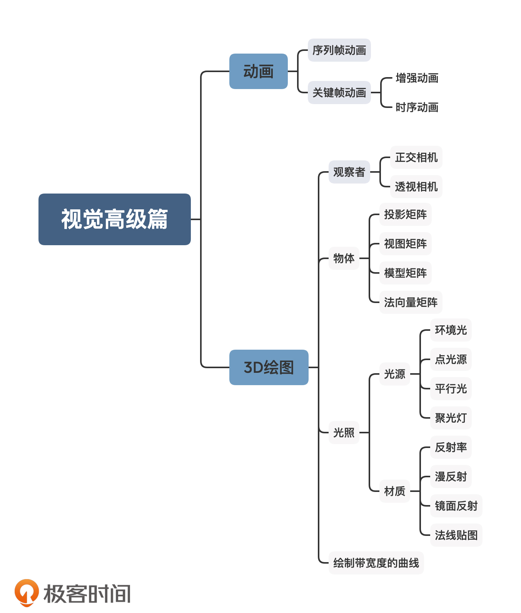
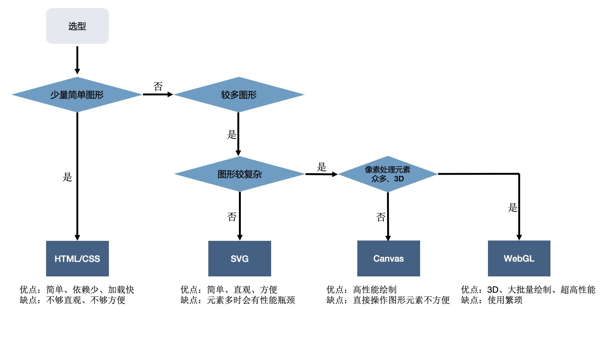
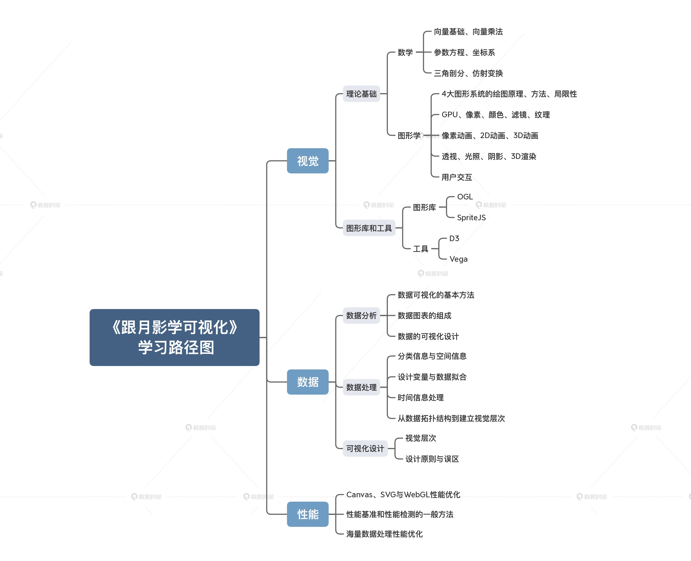

<!--
 * @LastEditTime: 2021-05-22 13:53:11
 * @LastEditors: jinxiaojian
-->
# 靳小健的可视化学习

## D D3学习
1. [0522地球](./anli/0522地图/my/index.html)
1. [0519轮块](./anli/0519轮块/my/index.html)

## C WebGL 实验 
[正方形](./WebGL/2/index.html)
[彩色正方形](./WebGL/3/index.html)
[旋转](./WebGL/4/index.html)
[旋转正方体](./WebGL/5/index.html)
[贴图](./WebGL/6/index.html)
[光照](./WebGL/7/index.html)
[视频](./WebGL/9/index.html)

## B 高级视觉篇

### 27 案例：如何实现简单的3D可视化图表？
1. [3d条形图](./27%20案例：如何实现简单的3D可视化图表/1/index.html)

### 19 如何用着色器实现像素动画 
1. [着色器帧动画](./19%20如何用着色器实现像素动画/1/index.html)

### 18 如何生成简单动画让图形动起来？
1. [固定帧动画](./18%20如何生成简单动画/1.html)
1. [增量动画](./18%20如何生成简单动画/2.html)
1. [时序动画](./18%20如何生成简单动画/3.html)
1. [封装动画类](./18%20如何生成简单动画/4/index.html)
1. [封装插值与缓动函数动画](./18%20如何生成简单动画/5/index.html)
1. [贝塞尔曲线缓动](./18%20如何生成简单动画/6/index.html)

## A 图形基础篇 

### 04 GPU与渲染管线：如何用WebGL绘制最简单的几何图形？
1. [webGl](./4%20GPU与渲染管线/1.html)

### 03 声明式图形系统：如何用SVG图形元素绘制可视化图表？
1. [svg](./3%20%E5%A3%B0%E6%98%8E%E5%BC%8F%E5%9B%BE%E5%BD%A2%E7%B3%BB%E7%BB%9F/1/1.html)
1. [svg+d3](./3%20%E5%A3%B0%E6%98%8E%E5%BC%8F%E5%9B%BE%E5%BD%A2%E7%B3%BB%E7%BB%9F/2/index.html)
1. [网格图](./3%20声明式图形系统/3/1.html)
1. [拐弯条形图](./3%20声明式图形系统/4/1.html)

### 02 指令式绘图系统：如何用Canvas绘制层次关系图？
1. [canvas](./2%20%E6%8C%87%E4%BB%A4%E5%BC%8F%E7%BB%98%E5%9B%BE%E7%B3%BB%E7%BB%9F/2/index.html)
1. [canvas+d3](./2%20%E6%8C%87%E4%BB%A4%E5%BC%8F%E7%BB%98%E5%9B%BE%E7%B3%BB%E7%BB%9F/3/index.html)
1. [canvas 压缩](./2%20%E6%8C%87%E4%BB%A4%E5%BC%8F%E7%BB%98%E5%9B%BE%E7%B3%BB%E7%BB%9F/4/1.html)

### 01 浏览器中实现可视化的四种方式 
1. [svg条](./1%20浏览器中实现可视化的四种方式/3/index.html)
1. [css饼](./1%20浏览器中实现可视化的四种方式/2/index.html)
1. [css条](./1%20浏览器中实现可视化的四种方式/1/index.html)

#####  路线

### 分享
[分享0430](./分享/1.html)

#####  要点
1. 图形基础：带你熟悉HTML/CSS、SVG、Canvas2D和WebGL这四种图形系统，学会它们的基本用法、优点和局限性，从而能在实际应用中选择合适的图形系统，以达到最好的视觉效果。
1. 数学基础：深入讲解向量、矩阵运算、参数方程、三角剖分以及仿射变换等内容，并配合综合运用，帮你建立一套通用的数学知识体系，适用于所有图形系统，以此来解决可视化图形呈现中的大部分问题。
1. 视觉呈现：和你讨论像素化、动画、3D和交互等话题，结合美颜、图片处理和视觉特效等实际例子，来应用各种数学和图形学知识，帮你全面提升视觉呈现的能力，实现更高级的视觉效果。
1. 性能优化：通过学习WebGL渲染复杂的2D、3D模型的方法，了解可视化高性能渲染的技术思路。在这一模块月影将和你分享他总结的一些成熟的方法论，帮助你在实现可视化项目的时候，解决大规模数据批量渲染的性能瓶颈问题。
1. 数据驱动：结合3D柱状图、3D层级结构图、3D音乐可视化等案例，讲解数据处理的技巧，真正正将数据和视觉呈现结合起来，实现具有科技感的3D可视化大屏效果，最终形成完整的可视化解决方案。