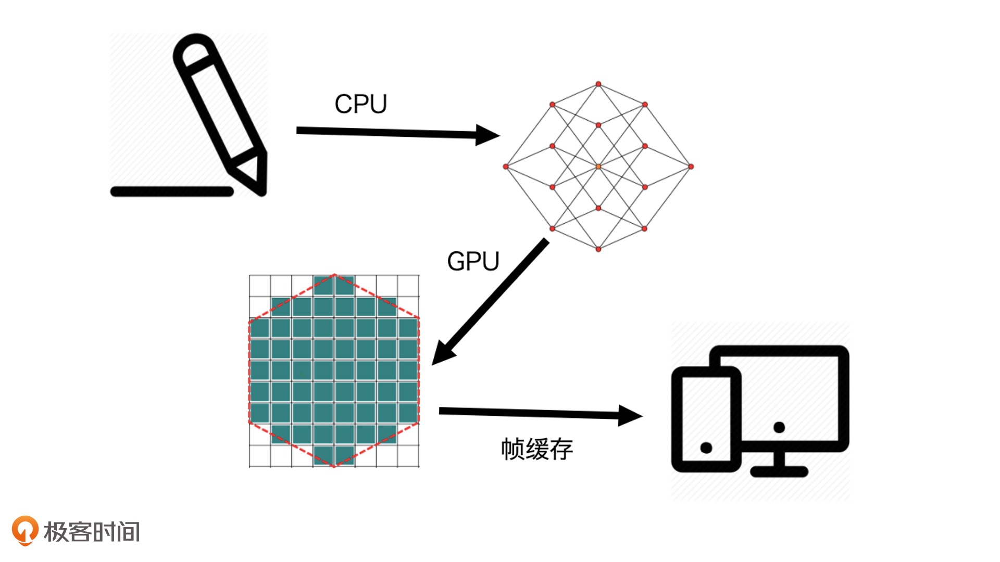

<!--
 * @LastEditTime: 2021-05-06 10:44:24
 * @LastEditors: jinxiaojian
-->
# 前端可视化


## 绘图技术

### 第 1 种是传统的 HTML+CSS
#### 这种方式通常用来呈现普通的 Web 网页,但是利用设置背景渐变也可绘制简单图表

[background](https://developer.mozilla.org/zh-CN/docs/Web/CSS/background)
[css条](https://jxj322991.github.io/keshihua/1%20%E6%B5%8F%E8%A7%88%E5%99%A8%E4%B8%AD%E5%AE%9E%E7%8E%B0%E5%8F%AF%E8%A7%86%E5%8C%96%E7%9A%84%E5%9B%9B%E7%A7%8D%E6%96%B9%E5%BC%8F/2/index.html)
[css饼](https://jxj322991.github.io/keshihua/1%20%E6%B5%8F%E8%A7%88%E5%99%A8%E4%B8%AD%E5%AE%9E%E7%8E%B0%E5%8F%AF%E8%A7%86%E5%8C%96%E7%9A%84%E5%9B%9B%E7%A7%8D%E6%96%B9%E5%BC%8F/1/index.html)

##### 动效
[transform](https://developer.mozilla.org/zh-CN/docs/Web/CSS/transform)
[transition](https://developer.mozilla.org/zh-CN/docs/Web/CSS/transition)
[animation](https://developer.mozilla.org/zh-CN/docs/Web/CSS/animation) 
##### 动画 
1. 固定帧动画 我们预先准备好要播放的静态图像，然后将这些图依次播放
2. 增量动画 在动态绘制图像的过程中，我们修改每一帧中某个或某几个属性的值，给它们一定的增量
3. 时序动画 在动态绘制图像的过程中，我们根据时间和动画函数计算每一帧中的关键属性值，然后更新这些属性

[固定帧动画](https://jxj322991.github.io/keshihua/18%20%E5%A6%82%E4%BD%95%E7%94%9F%E6%88%90%E7%AE%80%E5%8D%95%E5%8A%A8%E7%94%BB/1.html)
[增量](https://jxj322991.github.io/keshihua/18%20%E5%A6%82%E4%BD%95%E7%94%9F%E6%88%90%E7%AE%80%E5%8D%95%E5%8A%A8%E7%94%BB/2.html)
[时序](https://jxj322991.github.io/keshihua/18%20%E5%A6%82%E4%BD%95%E7%94%9F%E6%88%90%E7%AE%80%E5%8D%95%E5%8A%A8%E7%94%BB/4/index.html)


### 第 2 种 SVG。
#### SVG 和传统的 HTML+CSS 的绘图方式差别不大。只不过，HTML 元素在绘制矢量图形方面的能力有些不足，而 SVG 恰好弥补了这方面的缺陷。

SVG 是一种使用 XML 描述 2D 图形的语言。
SVG 基于 XML，这意味着 SVG DOM 中的每个元素都是可用的。您可以为某个元素附加 JavaScript 事件处理器。
在 SVG 中，每个被绘制的图形均被视为对象。如果 SVG 对象的属性发生变化，那么浏览器能够自动重现图形。

```
  <svg xmlns="http://www.w3.org/2000/svg" width="120px" height="240px" viewBox="0 0 60 100">
    <g transform="translate(0, 100) scale(1, -1)">
      <g>
        <rect x="1" y="0" width="10" height="25" fill="#37c"/>
        <rect x="13" y="0" width="10" height="26" fill="#37c"/>
        <rect x="25" y="0" width="10" height="40" fill="#37c"/>
        <rect x="37" y="0" width="10" height="45" fill="#37c"/>
        <rect x="49" y="0" width="10" height="68" fill="#37c"/>
      </g>
      <g>
        <rect x="1" y="0" width="10" height="15" fill="#3c7"/>
        <rect x="13" y="0" width="10" height="11" fill="#3c7"/>
        <rect x="25" y="0" width="10" height="17" fill="#3c7"/>
        <rect x="37" y="0" width="10" height="25" fill="#3c7"/>
        <rect x="49" y="0" width="10" height="37" fill="#3c7"/>
      </g>
    </g>
  </svg>
```
[效果](https://jxj322991.github.io/keshihua/1%20%E6%B5%8F%E8%A7%88%E5%99%A8%E4%B8%AD%E5%AE%9E%E7%8E%B0%E5%8F%AF%E8%A7%86%E5%8C%96%E7%9A%84%E5%9B%9B%E7%A7%8D%E6%96%B9%E5%BC%8F/3/index.html)

[图表](https://jxj322991.github.io/keshihua/3%20%E5%A3%B0%E6%98%8E%E5%BC%8F%E5%9B%BE%E5%BD%A2%E7%B3%BB%E7%BB%9F/1/1.html)
[网格图](https://jxj322991.github.io/keshihua/3%20%E5%A3%B0%E6%98%8E%E5%BC%8F%E5%9B%BE%E5%BD%A2%E7%B3%BB%E7%BB%9F/3/1.html)
[异形图](https://jxj322991.github.io/keshihua/3%20%E5%A3%B0%E6%98%8E%E5%BC%8F%E5%9B%BE%E5%BD%A2%E7%B3%BB%E7%BB%9F/4/1.html)

- 不依赖分辨率
- 支持事件处理器
- 复杂度高会减慢渲染速度（任何过度使用 DOM 的应用都不快）
- 不适合游戏应用

### 第 3 种  Canvas2D
### 这是浏览器提供的 Canvas API 中的其中一种上下文，使用它可以非常方便地绘制出基础的几何图形

Canvas 通过 JavaScript 来绘制图形
Canvas 是逐像素进行渲染的
在 canvas 中，一旦图形被绘制完成，它就不会继续得到浏览器的关注
如果其位置发生变化，那么整个场景也需要重新绘制

```
const canvas = document.querySelector('canvas');
const context = canvas.getContext('2d');
const rectSize = [100, 100];
context.fillStyle = 'red';
context.beginPath();
context.rect(0.5 * (canvas.width - rectSize[0]), 0.5 * (canvas.height - rectSize[1]), ...rectSize);
context.fill();
```

[效果](https://jxj322991.github.io/keshihua/2%20%E6%8C%87%E4%BB%A4%E5%BC%8F%E7%BB%98%E5%9B%BE%E7%B3%BB%E7%BB%9F/1/index.html)


[压缩图片](https://jxj322991.github.io/keshihua/2%20%E6%8C%87%E4%BB%A4%E5%BC%8F%E7%BB%98%E5%9B%BE%E7%B3%BB%E7%BB%9F/4/1.html)
[小游戏](https://jxj322991.github.io/jump-game/play.html)


- 依赖分辨率
- 不支持事件处理器
- 弱的文本渲染能力
- 能够以 .png 或 .jpg 格式保存结果图像
- 最适合图像密集型的游戏，其中的许多对象会被频繁重绘


### 第 4 种  WebGL
#### 这是浏览器提供的 Canvas API 中的另一种上下文，它是 OpenGL ES 规范在 Web 端的实现。通过它，用 GPU 渲染各种复杂的 2D 和 3D 图形。
WebGL 利用了 GPU 并行处理的特性，这让它在处理大量数据展现的时候，性能大大优于前 3 种绘图方式。因此，在可视化的应用中，一些数据量大、视觉效果要求高的特殊场景，使用 WebGL 渲染是一种比较合适的选择

- 光栅（Raster）：几乎所有的现代图形系统都是基于光栅来绘制图形的，光栅就是指构成图像的像素阵列。
- 像素（Pixel）：一个像素对应图像上的一个点，它通常保存图像上的某个具体位置的颜色等信息。
- 帧缓存（Frame Buffer）：在绘图过程中，像素信息被存放于帧缓存中，帧缓存是一块内存地址。
- CPU（Central Processing Unit）：中央处理单元，负责逻辑计算。
- GPU（Graphics Processing Unit）：图形处理单元，负责图形计算。




[效果](https://jxj322991.github.io/keshihua/4%20GPU%E4%B8%8E%E6%B8%B2%E6%9F%93%E7%AE%A1%E7%BA%BF/1.html)

[正方体](https://jxj322991.github.io/keshihua/WebGL/5/index.html)
[贴图/光照](https://jxj322991.github.io/keshihua/WebGL/7/index.html)
[视频](https://jxj322991.github.io/keshihua/WebGL/9/index.html)

### 小结


## 工具

### 处理数据的数据驱动框架
一种特殊的库，它们更专注于处理数据的组织形式，而将数据呈现交给更底层的图形系统（DOM、SVG、Canvas）或通用图形库（SpriteJS、ThreeJS）去完成

[D3](https://www.d3js.org.cn/)


[canvas d3](https://jxj322991.github.io/keshihua/2%20%E6%8C%87%E4%BB%A4%E5%BC%8F%E7%BB%98%E5%9B%BE%E7%B3%BB%E7%BB%9F/3/index.html)
[svg d3](https://jxj322991.github.io/keshihua/3%20%E5%A3%B0%E6%98%8E%E5%BC%8F%E5%9B%BE%E5%BD%A2%E7%B3%BB%E7%BB%9F/2/index.html)

### 专业呈现各种类型图表的图表库
可视化应用通常需要绘制大量的图表，比如，柱状图、折线图、饼图，还有一些简单的平面地图等等。图表库能够帮助我们快速把它们绘制出来


[g2](https://antv-g2.gitee.io/zh/examples/gallery)
[g6](https://g6.antv.vision/zh/examples/gallery)

### 专业处理视觉呈现的渲染库
绘制其他更灵活的图形、图像或者物理模型，我们常用的一些图表库就不一定能完成了。这个时候，我们可以用ThreeJS、SpriteJS这样比较通用的渲染库。

[ThreeJS](https://threejs.org/)
[ThreeJS](http://jxjweb.top/2019/12/25/)
[SpriteJS](https://jxj322991.github.io/keshihua/27%20%E6%A1%88%E4%BE%8B%EF%BC%9A%E5%A6%82%E4%BD%95%E5%AE%9E%E7%8E%B0%E7%AE%80%E5%8D%95%E7%9A%843D%E5%8F%AF%E8%A7%86%E5%8C%96%E5%9B%BE%E8%A1%A8/1/index.html)


###### 谢谢 靳肖健

