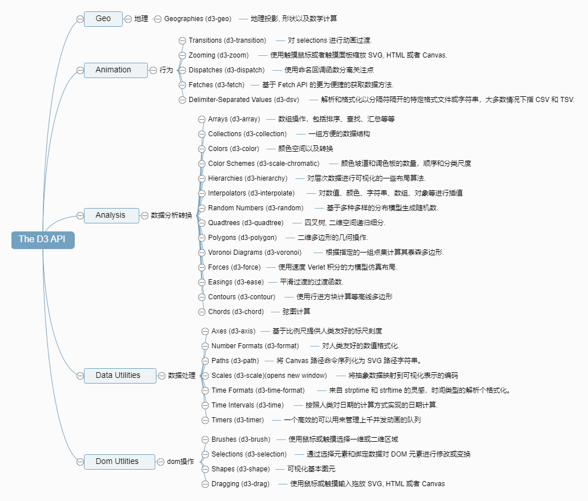
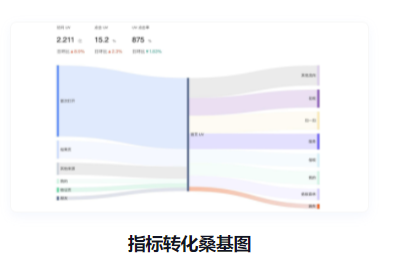
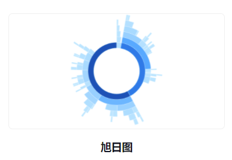

<!--
 * @LastEditTime: 2021-10-28 16:08:46
 * @LastEditors: jinxiaojian
-->
###### 可视化画图过程简单说来就是把数据映射成视觉元素，再以特定方式布局到画布上。布局核心是要知道每个元素的坐标/尺寸/角度/相对位置等等数据，可以是自己计算出来，也可以是 D3.js 自带的许多布局函数生成的数据。

# D3
###### 靳肖健

### D3的全称是 Data-Driven Documents（数据驱动文档），是基于数据来操作文档的 JavaScript 库，其核心在于使用绘图指令对数据进行转换，在源数据的基础上创建新的可绘制数据， 生成绘图数据以及通过数据和方法在DOM中创建数据可视化元素。可以帮助你使用 HTML, CSS, SVG 以及 Canvas 来展示数据。

## 其核心在于使用绘图指令对数据进行转换，在源数据的基础上创建新的可绘制数据， 生成数据用以通过数据控制DOM。

## api 分类
### DOM操作、数据处理，数据分析转换、地理路径，行为等


## API 举例
### D3-selection（选择集） 是 D3js的核心模块，主要是用来进行选择元素，设置属性、数据绑定，事件绑定等操作
```
d3.selectAll("p").style("color", "white");
```
### D3-scale（比列尺） 提供多种不同类型的比例尺。经常和 D3-axis 坐标轴模块一起使用。
1. 连续性输入(domain)和连续性输出(range)
1. 连续性输入(domain)和离散性输出(range)
1. 离散性输入(domain)和离散性输出(range)
```
d3.scaleLinear().domain([0,1]).range[1,100] //1
d3.scaleQuantize().domain([0,1]).range['red','blue'] //2
d3.scaleOrdinal().domain([1,2,3]).range['a','b','c'] //3
```

## 数据与元素 (Join 思想)
###### 不应该告诉D3去怎么创建元素, 而是告诉D3，.selectAll() 得到的 selecion 集合应该和 .data(data) 绑定的数据要怎么一一对应
### 数据绑定的时候可能出现 DOM 元素与数据元素个数不匹配的问题，那么 enter 和 exit 就是用来处理这个问题的。enter 操作用来添加新的 DOM 元素，exit 操作用来移除多余的 DOM 元素。

Update: 已经和data数据绑定的DOM元素集合
Enter：data数据没有找到与之对应的DOM元素集合
Exit: 没有被数据绑定的DOM元素集合


```
// Update 
var p = d3.select("body")
	.selectAll("p")
	.data([4, 8, 15, 16, 23, 42])
	.text(function(d) { return d; });      

// Enter 情形1
p.enter().append("p")
    .text(function(d) { return d; });

// Exit 情形3
	p.exit().remove();
```
### 一个简单示例:
[条形图](./example.html)





## 学习D3的困难

#### 如果是画桑基图，旭日图 , 甚至是更难的图等等，首先从数据库中取出数据，再将数据组织成图形所支持的格式数据; 这种操作会非常费脑,这就造成虽然理解 D3 的基本概念,知道有哪些api, 但还是难以做到对着文档,想怎么做就得到想要的效果。

### D3作图不仅需要记有哪些种类的API, 还需要数据处理(点位换算等等)的知识, 并且要理解数据转换与绘制分开模式
#### 一个函数输入数据绘制出图形,一般人的思维是这样的, 但是d3 将两者分开了
##### 有时候数据是要在处理/分析函数中运转后,才得到的最后绘图数据, 分开后能带来极大的自由度. 但是不能所见即所得, 不利于理解

### 许多时候，我们需要从网上找到一个示例，然后将它修改为实际工程中所需要的 , 但是如何找是一个问题?

### [codepen](https://codepen.io/)
### [D3文档](https://www.d3js.org.cn/)
### [D3可视化讨论区](https://observablehq.com)

## 谢谢!